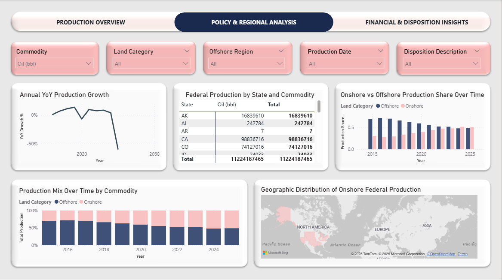
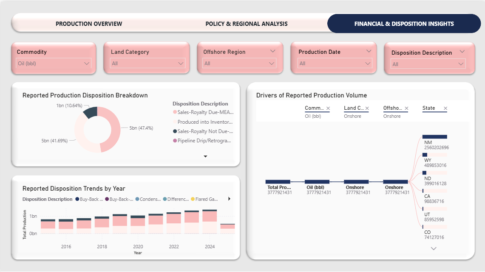

# 📊 U.S. Federal Oil & Gas Production & Disposition Analysis (2015–2025)

This project analyzes monthly **U.S. federal oil and natural gas production** using official data from the **U.S. Department of the Interior – Office of Natural Resources Revenue (ONRR)**.  
The dashboard focuses on production trends, geographic concentration, policy-relevant structure, and reported disposition categories.

---

## 🗂️ Dataset

- Monthly production and disposition records (OGOR-B)
- 🛢️ Commodities:
  - Oil (barrels)
  - Natural Gas (Mcf)
- 🌍 Coverage:
  - Federal onshore lands
  - Federal offshore waters (Gulf of Mexico, Alaska, Pacific)
  - Native American lands (geographic detail intentionally suppressed)
- ⏱️ Time span: January 2015 – September 2025
- 📜 License: Public Domain (CC0)

🔗 **Official Data Source:**  
https://www.kaggle.com/datasets/pinuto/us-oil-and-gas-production-and-disposition-20152025

> ⚠️ The full dataset is not included in this repository due to GitHub file size limits.  
> All data used in this project is publicly available from ONRR.

---

## 🧹 Data Preparation & Modeling

- 📅 Standardized production dates for time-series analysis
- 🔢 Converted volume fields to numeric data types
- ⚖️ Separated oil (barrels) and gas (Mcf) to avoid unit distortion
- 🧮 Built a dedicated Date table for accurate YoY calculations
- 📐 Implemented commodity-safe DAX measures
- 🧾 Treated disposition records as reported accounting categories, not additive physical production

---

## 📊 Dashboard Structure

### 📄 Page 1 — Production Overview
*How much is produced, how fast is it changing, and where does it come from?*

- Total production by land category (onshore vs offshore)
- Offshore production by region
- Top producing states (onshore federal production only)
- Production trend by year and land category
- Production trend by selected commodity
- Year-over-year production growth (commodity-safe)

---

### 🏛️ Page 2 — Policy & Regional Analysis
*Who produces, where, and under what structure?*

- Annual year-over-year production growth
- State × commodity production matrix
- Geographic distribution of onshore federal production
- Onshore vs offshore production share over time

---

### 💰 Page 3 — Financial & Disposition Insights
*How reported production is monetized and accounted for*

- Reported production disposition breakdown
- Reported disposition trends by year
- Decomposition tree explaining drivers of reported production volume

> ⚠️ Disposition volumes represent reported accounting categories and are not additive physical production totals.

---

## 🧠 Key Insights

- 📌 Federal oil and gas production is highly concentrated by state and offshore region
- 🌊 Offshore production is dominated by the Gulf of Mexico
- 🔄 The balance between onshore and offshore production has shifted over time
- 💼 Disposition data reflects monetization and accounting patterns, not physical extraction alone

---

## 🛠️ Tools & Technologies

- 📊 Power BI
- 🧠 DAX
- 🏛️ Public U.S. government datasets (ONRR)

---

## ▶️ How to View

- Download the `.pbix` file and open it using **Power BI Desktop**
- 🖼️ Screenshot previews are included for quick reference

> ℹ️ Interactive web viewing requires a Power BI work or school account.
